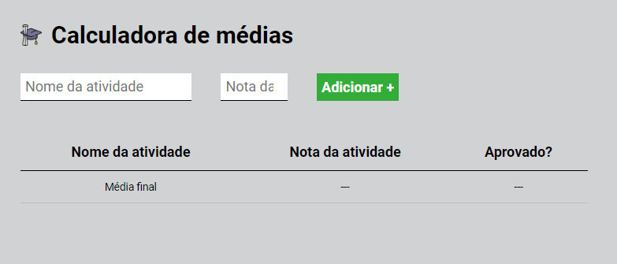

# Projeto 02: Calculadora de médias

#### Neste Projeto pratiquei junto a aula HTML, css e JavaScript. Coloquei em pratica os conhecimento dos modulos anteriores e a calculadora ficou simples e pratica para utilizar

- Vou fazer upload na vercel, também vou deixa um imagem da calculadora que você pode clicar para ter acesso. 👇

###

    <a href="https://ebac-projeto-02-flax.vercel.app/">
         </img>
    </a>

